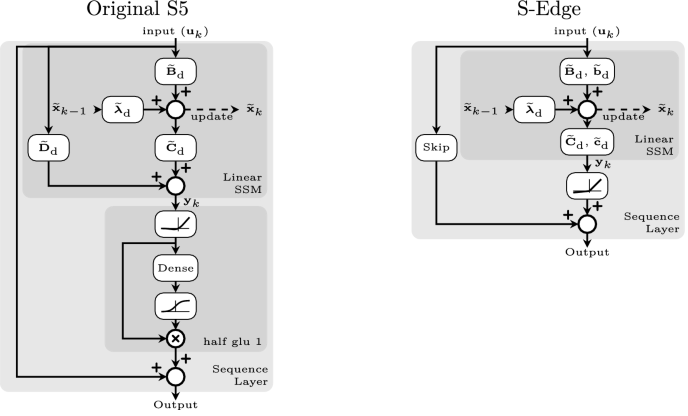

# S-Edge: Efficient and interpretable raw audio classification with diagonal state space models

This repository provides code and implementation for the paper

**Efficient and interpretable raw audio classification with diagonal state space models**  
Matthias Bittner\*, Daniel Schnöll\*, Matthias Wess Axel Jantsch 
Mach Learn 114, 175 (2025), presented at ECMLPKDD'25 

\* Equal contribution

[DOI-Paper Link](https://doi.org/10.1007/s10994-025-06807-z)  

[C++ implementation for S-Edge](https://github.com/embedded-machine-learning/Cpp-NN)  


<p style="text-align: center;">
Figure 1: The discrete recurrent forward path of our proposed S-Edge compared to the Original S5.
</p>

The S-Edge layer builds on the prior S5 [paper](https://arxiv.org/abs/2208.04933), while S5 in implemented in JAX [s5-jax version](https://github.com/lindermanlab/S5) we operate in PyTorch, and started with the PyTorch ported version of S5 [s5-pytorch](https://github.com/i404788/s5-pytorch), where we just used and modified the base implementation of the SSM class.

## Requirements & Installation
To run the code on your machine you can install the requirements by running
`python setup.py` within your venv.

## Repository Structure
Directories and files within the repo
```
hyperparameters                     Hyperparameter configurations
model_descriptions                  Architetcure configurations S-Edge-{Full-Tiny}
src/                                Source code
    model           Models, RZOH-Regularaization, etc.
    utils           Utils for datasets, experiment manager etc.

full_model_to_code_test.py          Performes training, export, conversion, and evaluation of S-Edge (with default values)
model_cpp_convert.py                Converts the exported weights into a C++ implementation
model_export.py                     Weight export for C++ implementation 
model_interpretability.ipynb        Interpretability of S-Edge (Eigenvalue, Transfer Function, Discret. Errors)  
queue_training.py                   Generate QUEUE for reproduzing all results 
setup.py                            Installs all requirements
test_sc_add_params_macs_to_test.py  Test whole results folder for inference frquencies of 16kHz, 8kHz, 4kHz
test_sc_cpp_impl.py                 Testing C++ implemented as if it were a PyTorch model*
test_sc.py                          Test single model with layer-wise downsampling (step-scale sweep)
train_analys_notebook.ipynb         Train History analysis of results
train_sc_from_queue.py              When executed trains the next model within the Queue (generated with queue_training.py)
train_sc.py                         Train a single model configuration
```
*The .so file for the C++ inference might not work properly unless it's compiled locally, since shared objects are often sensitive to system architecture, Python version, and linked libraries.

Directories that may be created on-the-fly:
```
data/               At first training Speech Commands automatically download
results_journal/    Results for individual runs (train_sc.py)       
results_vsc/        When reproducing all model training runs (generated with queue_training.py)
export_model/       The default location of exported models (model_export.py)
cpp_model/          The default location, for copying and generating C++ implementation (model_cpp_convert.py)
```

## How to get from a untrained model towards the C++ Implementation?

1. Choose a model configuration S-Edge-{L-Tiny}
2. Train the model with `train_sc.py`
3. Within the results_journal folder you can see observe the training run with run id e.g., `Run#0`.
4. Play with analysis tools and methods
5. Decide which downsampling, (step-scale) configurations you would like to apply/test. `test_sc.py` runs a full sweep for a selected model.
6. `model_export.py` tests a model with differnt step scales and compares the Pytorch vs Numpy accuracy.
7. Use the generated `model_dict.npy` with the [C++ implementation for S-Edge](https://github.com/embedded-machine-learning/Cpp-NN), by configuring and running `model_cpp_convert.py`
8. If desired modify the `cpp_model/test_SEdge.cpp` file to enable benchmarking data.
9. If porting it to an MCU check out the release [STM implementation](https://github.com/embedded-machine-learning/Cpp-NN/releases/tag/cpp20), especially `nn.hpp`and `nn.cpp` for minimal overhead and C compadability. 


## Citation
Please use the following when citing our work:
```
@article{bittner2025sedge,
  author       = {Matthias Bittner and
                  Daniel Schnöll and
                  Matthias Wess and
                  Axel Jantsch},
  title        = {Efficient and interpretable raw audio classification with diagonal
                  state space models},
  journal      = {Mach. Learn.},
  volume       = {114},
  number       = {8},
  pages        = {175},
  year         = {2025},
  url          = {https://doi.org/10.1007/s10994-025-06807-z},
  doi          = {10.1007/S10994-025-06807-Z},
  timestamp    = {Sun, 29 Jun 2025 21:59:59 +0200},
  biburl       = {https://dblp.org/rec/journals/ml/BittnerSWJ25.bib},
  bibsource    = {dblp computer science bibliography, https://dblp.org}
}
```

Do not heasitate to reach out if you have any questions.